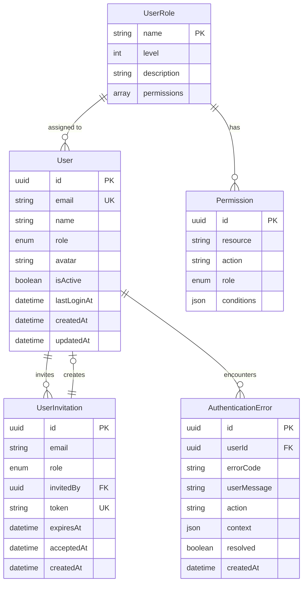

# Data Model: Enhanced Authentication UX and User Management

**Date**: 2025-01-26  
**Feature**: Enhanced Authentication UX and User Management  
**Purpose**: Define entities, relationships, and data structure for authentication and user management

## Entity Definitions

### User

**Purpose**: Represents authenticated users with role-based access control

**Attributes**:

- `id`: UUID (Primary Key) - Unique user identifier
- `email`: String (Unique, Required) - User's email address
- `name`: String (Required) - User's display name
- `role`: UserRole (Required) - User's permission level (GUEST, USER, ADMIN)
- `avatar`: String (Optional) - URL to user's avatar image
- `isActive`: Boolean (Default: true) - Whether user account is active
- `lastLoginAt`: DateTime (Optional) - Last successful login timestamp
- `createdAt`: DateTime - Account creation timestamp
- `updatedAt`: DateTime - Last update timestamp

**Relationships**:

- One-to-many with UserInvitation (admin creates invitations)
- One-to-many with AuthenticationError (user's auth errors)

**Validation Rules**:

- Email must be valid format and unique
- Name must be 2-50 characters
- Role must be valid enum value
- Avatar URL must be valid if provided

### UserRole

**Purpose**: Defines permission levels with hierarchical access control

**Attributes**:

- `name`: String (Primary Key) - Role name (GUEST, USER, ADMIN)
- `level`: Integer (Required) - Hierarchy level (0=GUEST, 1=USER, 2=ADMIN)
- `description`: String (Required) - Human-readable role description
- `permissions`: Array<String> (Required) - List of allowed actions

**Validation Rules**:

- Level must be unique
- Permissions must be valid action strings
- Description must be 10-100 characters

**Role Hierarchy**:

- **GUEST** (level 0): Can view public content only
- **USER** (level 1): Can access protected features, manage own data
- **ADMIN** (level 2): Can manage users, access all features

### AuthenticationError

**Purpose**: Represents different types of authentication failures with specific error codes and messages

**Attributes**:

- `id`: UUID (Primary Key) - Unique error identifier
- `userId`: UUID (Optional) - User who encountered the error
- `errorCode`: String (Required) - Technical error code from Supabase
- `userMessage`: String (Required) - User-friendly error message
- `action`: String (Required) - Action that triggered the error
- `context`: JSON (Optional) - Additional error context
- `resolved`: Boolean (Default: false) - Whether error was resolved
- `createdAt`: DateTime - Error occurrence timestamp

**Relationships**:

- Many-to-one with User (optional, for authenticated users)

**Validation Rules**:

- Error code must be valid Supabase error code
- User message must be 10-200 characters
- Action must be valid authentication action

### UserInvitation

**Purpose**: Represents pending user invitations with email, role, and 7-day expiration

**Attributes**:

- `id`: UUID (Primary Key) - Unique invitation identifier
- `email`: String (Required) - Invited user's email
- `role`: UserRole (Required) - Role to assign to new user
- `invitedBy`: UUID (Required) - Admin who sent invitation
- `token`: String (Required) - Secure invitation token
- `expiresAt`: DateTime (Required) - Invitation expiration (7 days)
- `acceptedAt`: DateTime (Optional) - When invitation was accepted
- `createdAt`: DateTime - Invitation creation timestamp

**Relationships**:

- Many-to-one with User (invitedBy - admin who sent invitation)
- One-to-one with User (when accepted, creates new user)

**Validation Rules**:

- Email must be valid format
- Token must be unique and secure
- Expiration must be exactly 7 days from creation
- Role must be valid UserRole

### Permission

**Purpose**: Defines what actions each role can perform on specific resources

**Attributes**:

- `id`: UUID (Primary Key) - Unique permission identifier
- `resource`: String (Required) - Resource being accessed (users, players, tournaments)
- `action`: String (Required) - Action being performed (read, write, delete, admin)
- `role`: UserRole (Required) - Role that has this permission
- `conditions`: JSON (Optional) - Additional permission conditions

**Validation Rules**:

- Resource must be valid resource type
- Action must be valid action type
- Role must be valid UserRole
- Conditions must be valid JSON if provided

## Data Relationships

## State Transitions

### User Account Lifecycle

1. **Invited**: UserInvitation created by admin
2. **Pending**: Invitation sent, waiting for acceptance
3. **Active**: User accepted invitation, account created
4. **Suspended**: Admin deactivated account
5. **Deleted**: Account permanently removed

### Authentication Error Lifecycle

1. **Occurred**: Error logged with context
2. **Acknowledged**: User sees error message
3. **Resolved**: User takes corrective action
4. **Archived**: Error marked as resolved

### User Invitation Lifecycle

1. **Created**: Admin creates invitation
2. **Sent**: Email sent to user
3. **Pending**: Waiting for user to accept
4. **Accepted**: User accepts, account created
5. **Expired**: Invitation expires after 7 days

## Data Validation Rules

### User Entity

- Email format validation using RFC 5322
- Name length: 2-50 characters
- Role must be one of: GUEST, USER, ADMIN
- Avatar URL must be valid if provided

### UserInvitation Entity

- Email format validation
- Token must be cryptographically secure
- Expiration must be exactly 7 days from creation
- Role must be valid UserRole

### AuthenticationError Entity

- Error code must be valid Supabase error code
- User message must be actionable and clear
- Action must be one of: login, signup, password_reset, token_refresh

## Indexes and Performance

### Primary Indexes

- `users.email` (unique index for fast lookups)
- `user_invitations.token` (unique index for fast token validation)
- `user_invitations.email` (index for duplicate prevention)
- `authentication_errors.user_id` (index for user error history)

### Composite Indexes

- `authentication_errors(user_id, created_at)` (for user error timeline)
- `user_invitations(expires_at, accepted_at)` (for cleanup queries)

## Data Migration Considerations

### Existing Data

- Current users will be migrated to new role system
- Existing sessions will be preserved during migration
- Error history will be maintained for analytics

### Migration Strategy

1. Add new columns to existing user table
2. Migrate existing users to USER role by default
3. Create admin users manually
4. Set up role-based permissions
5. Deploy new authentication flow
